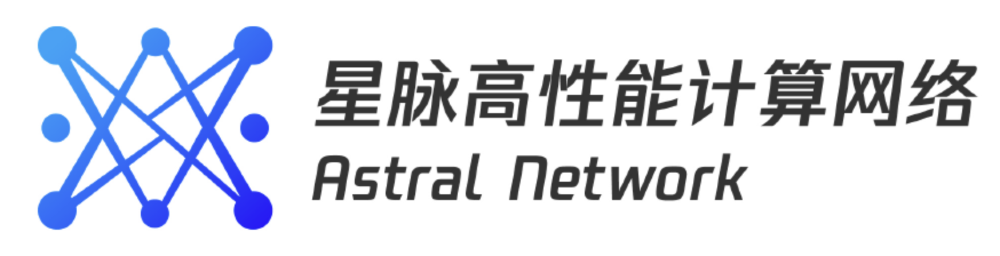

  

# 简介

星脉网络是面向AI大模型量身定制的高性能算力网络, 为大模型业务提供极致性能、极致可靠的网络底座.

当前星脉网络1.0、2.0已经全面支撑腾讯各类大模型业务。星脉3.0是正在研发设计的下一代算力网络, 目标是解决GPU算力迅猛增长与网络带宽增长相对缓慢的矛盾.

星脉3.0通过scale out + scale up双引擎网络架构, 在超节点、网络硬件、软件协议、通信库、运营平台等关键功能模块上进行全面升级, 为GPU之间提供超高带宽互联域, 大幅降低TP/EP/CP等通信占比, 最终打破集群算力瓶颈.

2025年4月，腾讯星脉网络推出新一代以GPU为核心的通信库TRMT，针对DeepSeek开源的MOE通信库DeepEP进行深度优化，在RoCEV2场景通信性能提升100%，在IB场景通信性能提升30%。
